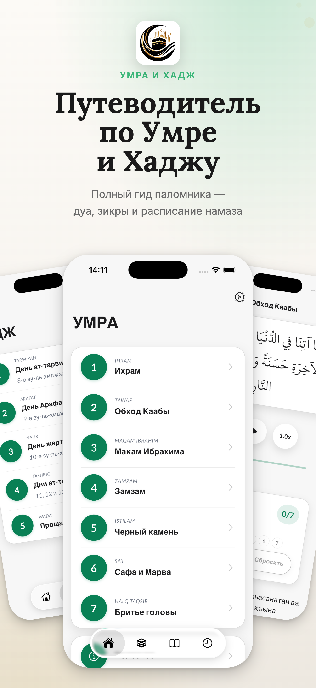
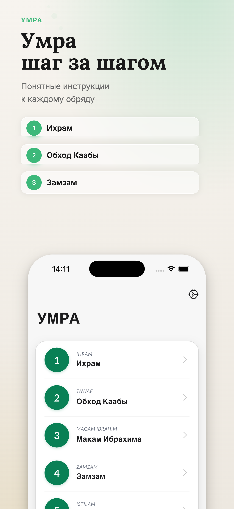
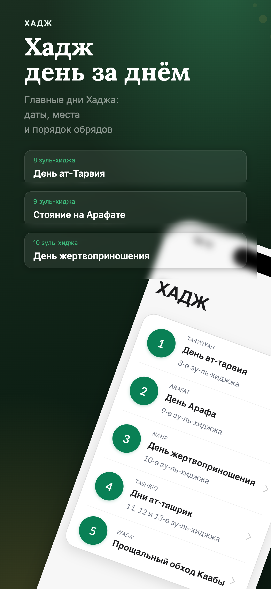
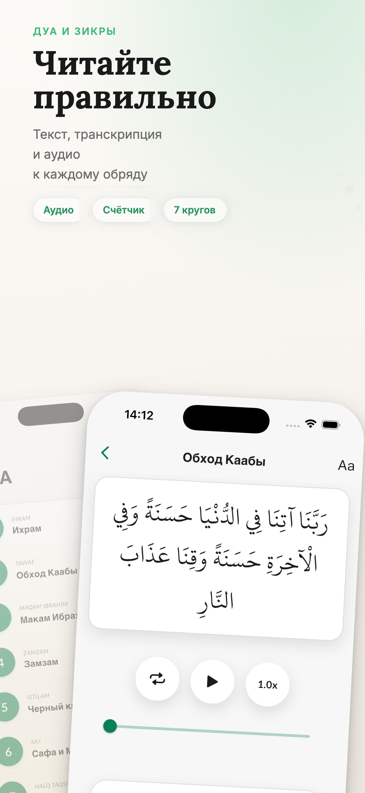
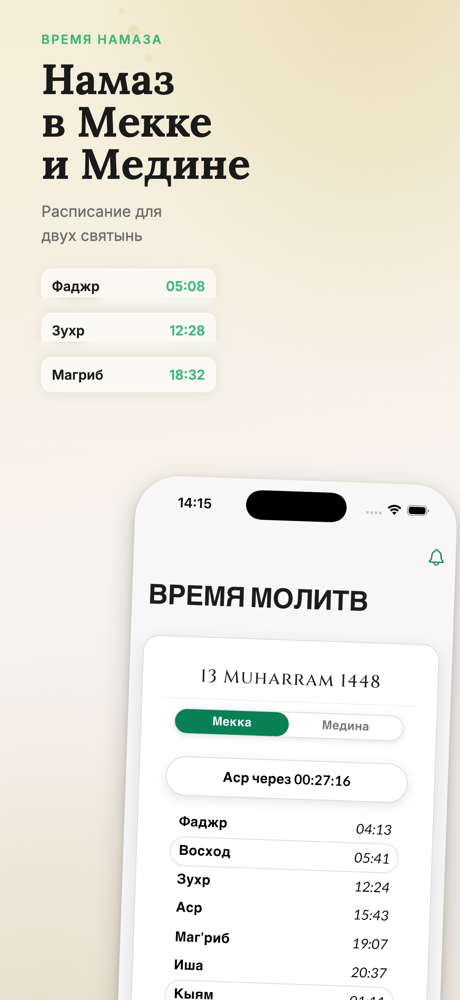
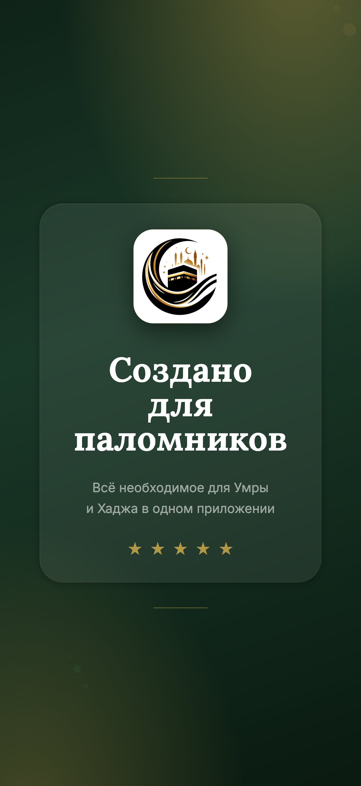

# 🕌 Umra Flutter

<p align="center">
  
</p>

<p align="center">
  <a href="https://apps.apple.com/ru/app/umra-guide/id1673683355">
    
  </a>
  <a href="https://play.google.com/store/apps/details?id=saydulayev.wien_gmail.com.umra">
    
  </a>
  
  
  
  
</p>

> Flutter-версия приложения **Umra Guide** — гид для мусульман, совершающих Умру.

---

## 📸 Скриншоты

<p align="center">
  
  
  
  
</p>
<p align="center">
  
  
  
</p>

---

## 📱 О проекте

Мобильное приложение-гид для совершения Умры с поддержкой нескольких языков, аудио-гидом, временем намаза и пошаговыми инструкциями.

**Поддерживаемые языки:** Русский, English, العربية, Deutsch, Français, Türkçe, Bahasa Indonesia

---

## ✨ Основные возможности

- 📖 Пошаговые инструкции для совершения Умры
- 🔊 Аудио-гид с произношением дуа
- 🕌 Время намаза и расчёт времени молитв
- 📅 Исламский (Хиджри) календарь
- 📄 PDF-материалы для чтения офлайн
- 🌍 Многоязычная поддержка (7 языков)
- 🎨 Несколько тем оформления
- 🔔 Уведомления о времени намаза
- 📿 Счётчик тавафов
- 📱 Поддержка iOS и Android

---

## 📲 Скачать

| Платформа | Ссылка | Рейтинг | Скачивания |
|-----------|--------|---------|------------|
| 🍎 iOS | [App Store](https://apps.apple.com/ru/app/umra-guide/id1673683355) | ⭐ 4.9/5 (246+ оценок) | 40,000+ |
| 🤖 Android | [Google Play](https://play.google.com/store/apps/details?id=saydulayev.wien_gmail.com.umra) | — | Доступно |

**Требования:** iOS 17.0+ / Android 6.0+ (API 23+)

---

## 🚀 Запуск проекта

```bash
flutter pub get
flutter run
```

---

## 📦 Основные зависимости

| Пакет | Назначение |
|-------|-----------|
| `provider` | Управление состоянием |
| `just_audio` + `audio_service` | Аудио-плеер с фоновым воспроизведением |
| `adhan_dart` | Расчёт времени намаза |
| `hijri_date` | Исламский календарь |
| `flutter_pdfview` | Просмотр PDF |
| `flutter_local_notifications` | Уведомления о намазе |
| `in_app_purchase` | Встроенные покупки |
| `in_app_review` | Запрос отзыва в приложении |
| `google_fonts` | Шрифты |
| `shared_preferences` | Локальное хранилище настроек |
| `flutter_localizations` | Локализация |

---

## 📁 Структура проекта

```
lib/
├── main.dart
├── models/          # Модели данных
├── providers/       # Провайдеры состояния
├── services/        # Бизнес-логика
├── screens/         # Экраны приложения
├── widgets/         # Переиспользуемые виджеты
└── l10n/            # Файлы локализации (7 языков)
```

---

## 🔧 Статус разработки

- ✅ Базовая структура и навигация
- ✅ Локализация (7 языков)
- ✅ Система тем оформления
- ✅ Пошаговые инструкции Умры
- ✅ Аудио-плеер (фоновое воспроизведение)
- ✅ Счётчик тавафов
- ✅ Время намаза с уведомлениями
- ✅ Хиджри-календарь
- ✅ PDF-материалы
- ✅ Поддержка Android 15 (Edge-to-Edge, API 35)
- ✅ Публикация в App Store и Google Play
- 🔄 В разработке: дополнительные функции и оптимизация

---

## 📄 Лицензия

[MIT License](LICENSE)
